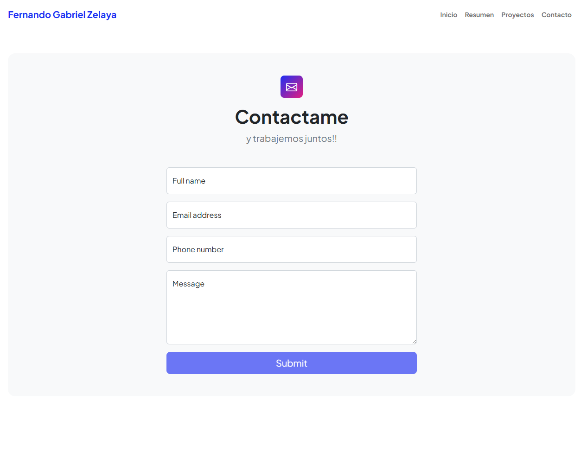
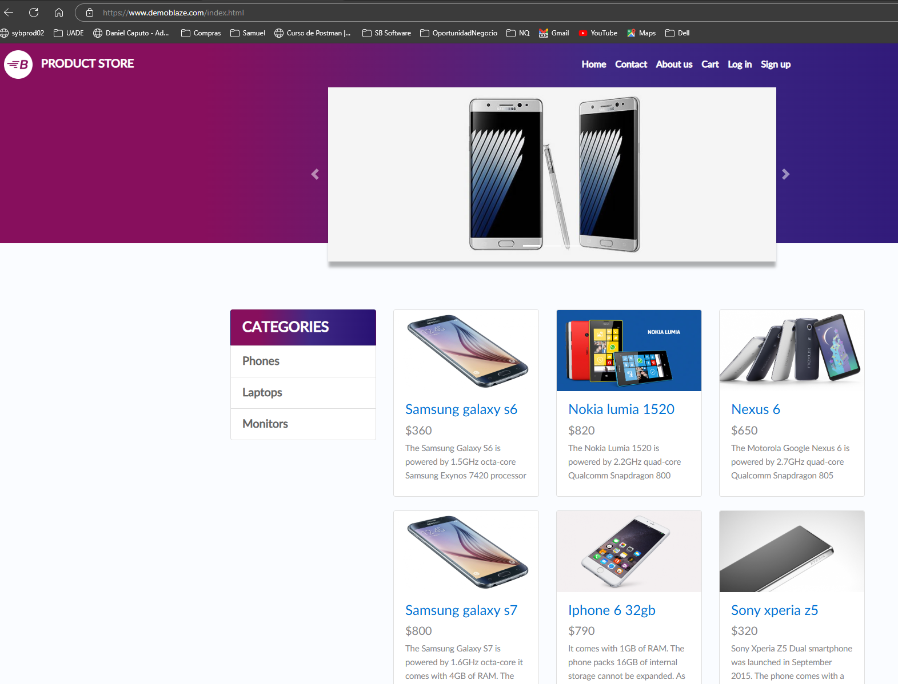

# Trabajo Practico Final - Monica Cantero Jara

Este repo contiene 2 ejercicios del trabajo practico final. 

# Ejercicio 1

Carga de formulario de https://fgzelaya.com.ar/contact.html

Carga de los datos y verificacion de mensaje de submit/guardado.

## Ejecucion

Para ejecutar el test hay que reemplazar en `TestRunner` el `tags` 
con el valor `@BugsFormOk`.

# Ejercicio 2

Busqueda de un elemento por id en la pagina https://www.demoblaze.com/prod.html?idp_=1.

Busqueda de la palabra "PRODUCT STORE" en la carga de la pagina.
El test hace un assert del titulo en lugar de imprimir por pantalla
solamente.

## Ejecucion

Para ejecutar el test hay que reemplazar en `TestRunner` el `tags`
con el valor `@LoadProductStore`.
